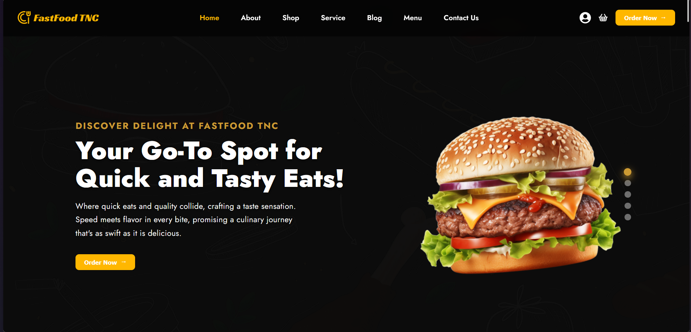

# 🍔 FastFood | Modern & Fully Dynamic Restaurant Web App

## 🔥 Project Overview

FastFood is a modern, fully dynamic restaurant platform designed to deliver a seamless and engaging food-ordering experience.  
Everything — from menu items and categories to blogs, news, and orders — is controlled live through an Admin Panel.

By combining clean UI, smooth user interactions, and a structured content management system, FastFood becomes a reliable and scalable restaurant solution suitable for real businesses.

🌐 Live Demo (add your link here)

---

## 🌟 Key Features

- Clean, modern, and visually appealing UI
- Fully responsive on all devices (mobile, tablet, desktop)
- Dynamic menu with real API integration
- Shopping cart with add/remove/update functionality
- Smooth and realistic checkout/order flow
- Blog & news section — fully managed via Admin Panel
- Optimized transitions and animations for a premium UX
- Built with React + TypeScript for scalability and performance

---

## 🚀 Why FastFood?

FastFood isn’t just another frontend project — it’s a production-ready restaurant system:

- Powerful CMS-driven content through the Admin Panel
- Scalable structure suitable for real commercial deployment
- Clean and maintainable codebase
- High level of UI polish & user experience
- Ready for future expansion: online payments, delivery tracking, user accounts, etc.

---

## 🛠️ Technologies Used

<p align="left">
  
  
  
  
</p>

---

### 🚀 **Getting Started**

Follow the steps below to set up FastFood on your machine:

1. **Clone the repository:**
   ```sh
   git clone https://github.com/ayoubakbartabar/FastFood-project-Ts-React-.git
   ```
2. **Navigate to the project directory:**
   ```sh
   cd FastFood-project-Ts-React-
   ```
3. **Install dependencies:**
   ```sh
   npm install
   ```
4. **Run the development server:**
   ```sh
   npm run dev
   ```
5. **Run the server:**
   ```sh
   json-server --watch db.json --port 3001
   ```

---

## 📦 Admin Panel (CMS)

To manage products, categories, articles, news, and orders, clone and run the Admin Panel:

**🔗 Admin Panel Repository:**  
https://github.com/ayoubakbartabar/FastFood-Admin-Panel-project

### 📥 Clone & Run

1. **Clone the repository:**
   ```sh
   git clone https://github.com/ayoubakbartabar/FastFood-Admin-Panel-project.git
   ```
2. **Navigate to the project directory:**
   ```sh
   cd FastFood-project-Ts-React-
   ```
3. **Install dependencies:**
   ```sh
   npm install
   ```
4. **Run the development server:**
   ```sh
   npm run dev
   ```

---

## 🤝 Contribution & Contact

Feedback, suggestions, and contributions are always welcome.  
Feel free to reach out if you’re interested in collaborating or have any questions.

---

## 👤 About the Developer

Crafted with passion by **[Ayoub Akbartabar](ayoubakbartabar1887@gmail.com)** – a developer who believes digital experiences should feel magical.  
If this project sparks your interest or you have any questions, feel free to reach out! ✉️

<p align="left">
  <a href="https://www.linkedin.com/in/ayoub-akbartabar-bb78b2212/" target="_blank">
    
  </a>
  <a href="https://github.com/ayoubakbartabar" target="_blank">
    
  </a>
  <a href="mailto:ayoubakbartabar1887@gmail.com" target="_blank">
    
  </a>
</p>
